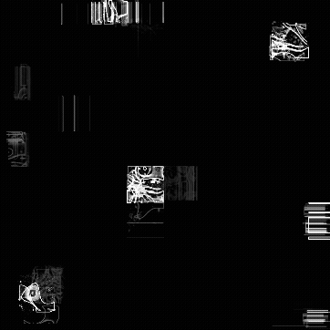
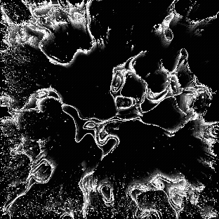
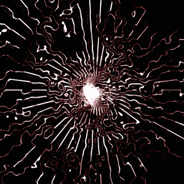
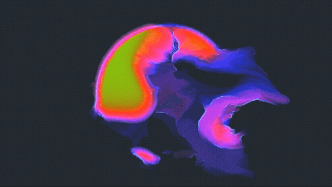
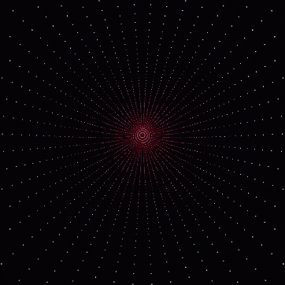
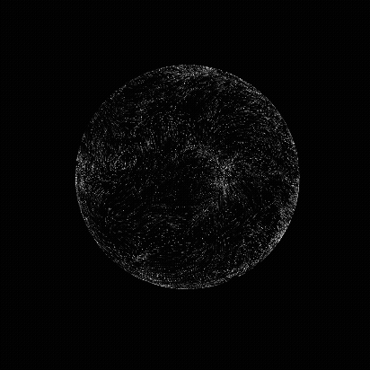
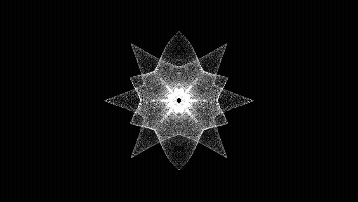
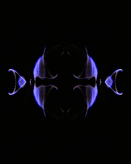
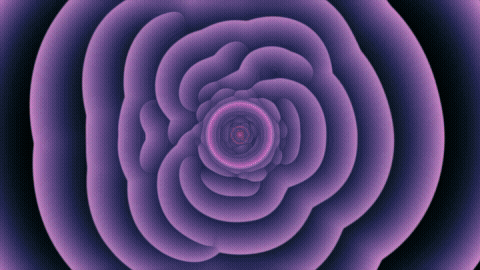

# TouchDesigner projects

## Informations

This repository store TouchDesigner's project created by Collecti'Frog 🐸 

## How to use

1. Install [TouchDesigner](https://derivative.ca/download) 
2. Clone this repo or download .zip and open .toe files with TouchDesigner

## List 

List of visuals made by Collecti'Frog 🐸 (with gif preview)

- `Finished/AbstractPixels/AbstractPixels.toe`

- `Finished/AbstractRing/AbstractRing_001.toe`

- `Finished/ColorFireBall/ColorFireBall_001.toe`

- `Finished/BallsWave/BallsWave_001.toe`

- `/Finished/Moon/Moon Surface Noise Using TouchDesigner POPs - Okamirufu Vizualizer`

- `Finished/ReactSon/ReactSon_001.toe`

- `Finished/ReactSon/ReactSon_101.toe`

- `Finished/Tunel/Tunel_001.toe`

- `Finished/WaterSime/WaterSim_001.toe`

